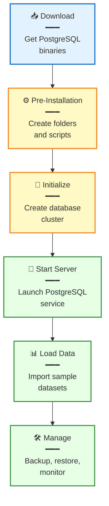
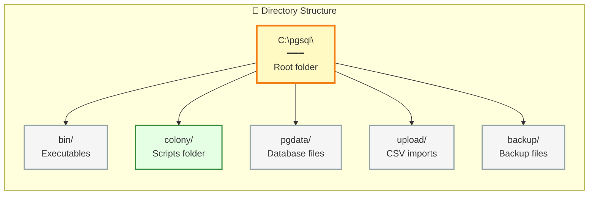
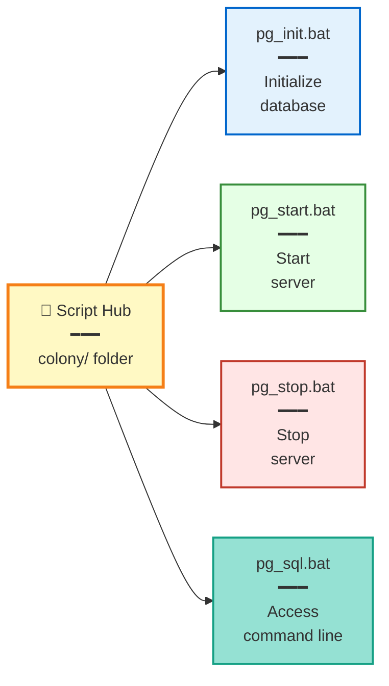
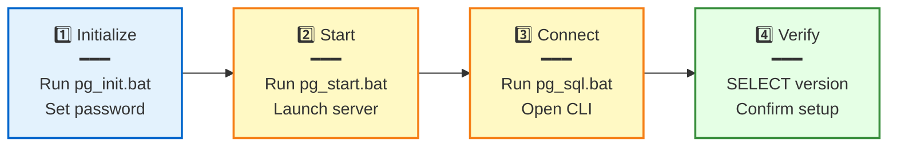
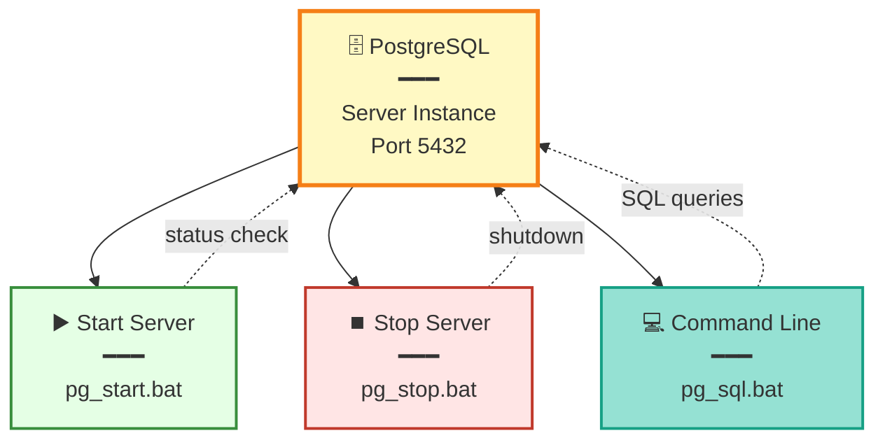
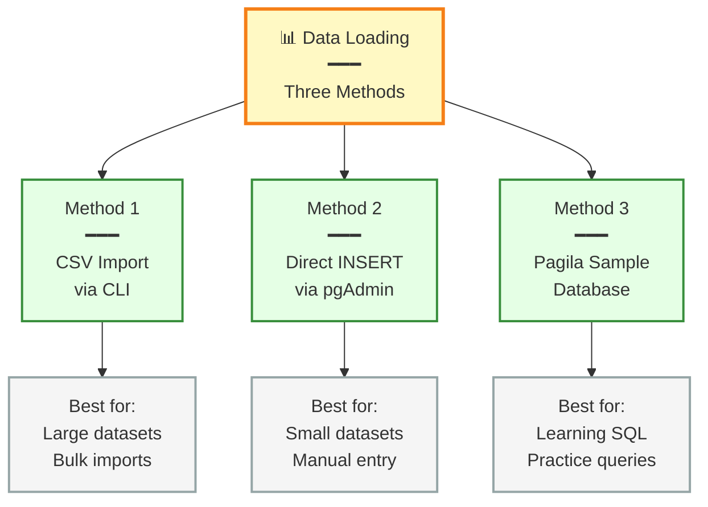
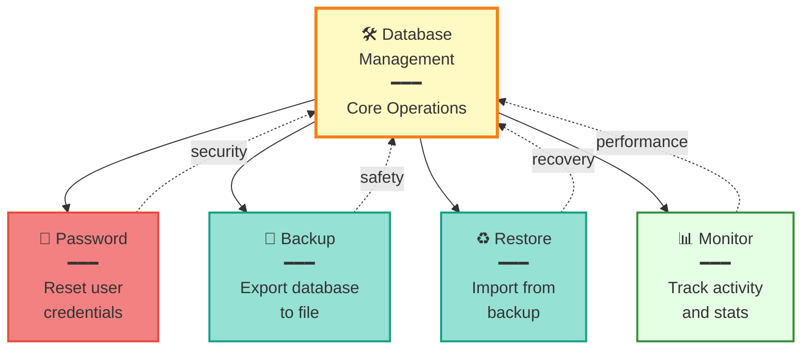
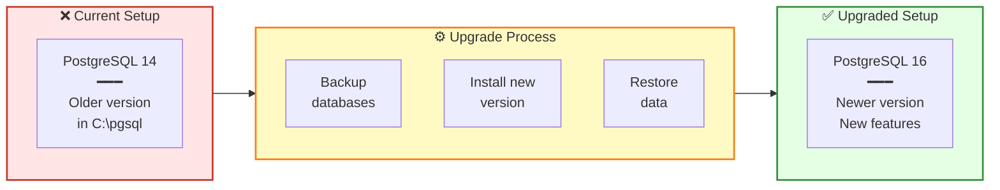
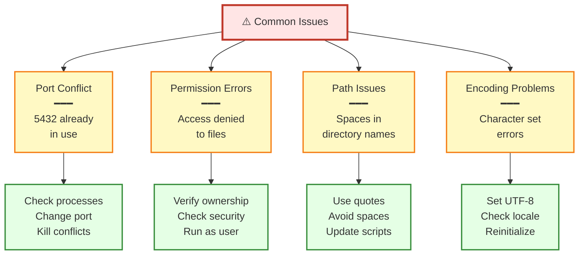

# PostgreSQL Installation and Setup on Windows Without Admin Rights

## 1. Preface

- Setting up PostgreSQL on a Windows machine often requires administrative permissions
- Not everyone has access to administrative privileges
- This guide shows the process of installing PostgreSQL using zipped binaries
- This method is particularly useful for setting up a development or trial environment where administrative permissions are not required
- By following these instructions, you can quickly get PostgreSQL up and running for development or testing purposes without administrative permissions
- **Important:** This setup should be considered temporary
  - For production environments, ensure all necessary permissions, security configurations, and best practices are followed
  - This guide focuses on development and testing scenarios

## 2. Contents of this Guide

- This guide provides step-by-step instructions for installing and setting up PostgreSQL on a Windows machine without requiring administrative privileges
- **Coverage areas:**
  - Downloading binaries
  - Initializing the database
  - Starting and stopping the server
  - Accessing the SQL command line
  - Importing data into your new database
  - Managing your database installation
  - Upgrading PostgreSQL versions
  - Troubleshooting common issues
- By following these steps, you will have a fully functional PostgreSQL installation with sample data



## 3. Pre-Installation Setup

- Before the actual installation of PostgreSQL, create some shortcuts and folders
- This preparation ensures a smooth installation process



### 3.1. Download PostgreSQL Binaries

- Download the PostgreSQL binaries from [EnterpriseDB](https://www.enterprisedb.com/download-postgresql-binaries)
- Extract the downloaded archive to a desired folder
  - Example location: `C:\pgsql`
- **Note:** You can choose any directory path that suits your needs
  - All examples in this guide use `C:\pgsql`
  - If using a different path, adjust all commands accordingly

### 3.2. Directory Structure

- After extraction, ensure you have `C:\pgsql\bin` and other standard PostgreSQL directories
- Create a new folder inside `C:\pgsql` and name it `colony`
  - Alternative names like `scripts` or `tools` are also acceptable
- **Recommended additional folders:**
  - `C:\pgsql\upload` for CSV files and import data
  - `C:\pgsql\backup` for database backup files
- The `pgdata` folder will be created automatically during initialization

### 3.3. Scripts

- Create four batch scripts to simplify database operations
- All scripts should be saved in the `colony` folder
- These scripts eliminate the need to type complex commands repeatedly



#### 3.3.1. Database Initialization Script

- Open Notepad and paste the following command:

```batch
C:\pgsql\bin\initdb -D C:\pgsql\pgdata -U postgres -W -E UTF8 -A scram-sha-256
```

- Save the file as `pg_init.bat` inside the `colony` folder
- **Breakdown of the arguments used:**
  - `-D C:\pgsql\pgdata` specifies the directory where the database cluster will be stored
  - `-U postgres` defines the username of the database superuser
  - `-W` prompts for a password for the new database superuser
  - `-E UTF8` sets the encoding for the database to UTF-8
  - `-A scram-sha-256` configures the authentication method for local connections to use SCRAM-SHA-256
- **Important:** You only need to run this script once during initial setup

#### 3.3.2. Start Database Script

- Open Notepad and paste the following command:

```batch
C:\pgsql\bin\pg_ctl -D C:\pgsql\pgdata -l C:\pgsql\pgdata\logfile start
```

- Save the file as `pg_start.bat` in the `colony` folder
- The `-l` flag specifies where to write server log output
- Run this script whenever you need to start the PostgreSQL server

#### 3.3.3. Stop Database Script

- Open Notepad and paste the following command:

```batch
C:\pgsql\bin\pg_ctl -D C:\pgsql\pgdata stop
```

- Save the file as `pg_stop.bat` in the `colony` folder
- Run this script to gracefully shut down the PostgreSQL server

#### 3.3.4. Access SQL Command Line Script

- Open Notepad and paste the following command:

```batch
C:\pgsql\bin\psql -U postgres -p 5432
```

- Save the file as `pg_sql.bat` in the `colony` folder
- The `-p 5432` explicitly specifies the port number
- Run this script to open the PostgreSQL command-line interface

### 3.4. Shortcut to PostgreSQL Admin

- Create a shortcut in the `colony` folder pointing to `C:\pgsql\pgAdmin 4\runtime\pgAdmin4.exe`
- pgAdmin provides a graphical interface for managing your PostgreSQL databases
- This shortcut provides quick access to the administration tool

## 4. PostgreSQL DB Installation

- Follow these steps to initialize and verify your PostgreSQL installation
- The installation process creates the necessary database files and configurations



### 4.1. Installation Steps

- **Step 1:** Initialize the PostgreSQL database by running `pg_init.bat`
  - Enter the desired password when prompted
  - Remember this password as you will need it for all future connections
  - The script creates the database cluster in `C:\pgsql\pgdata`
- **Step 2:** Start the server by running `pg_start.bat`
  - Wait a few seconds for the server to fully start
  - Check the log file at `C:\pgsql\pgdata\logfile` if issues occur
- **Step 3:** Access the SQL command line by running `pg_sql.bat`
  - Enter the password you set in Step 1 when prompted
- **Step 4:** Verify the installation by running the following command:

```sql
SELECT version();
```

- You should see PostgreSQL version information displayed
- If the command executes successfully, your installation is complete
- You are now ready to use your PostgreSQL database

## 5. Using Your New Database

- After completing the installation steps, you have a working PostgreSQL server
- The batch files created earlier (`pg_start.bat`, `pg_stop.bat`, and `pg_sql.bat`) simplify database operations
- These scripts eliminate the need to run complex commands each time
- See detailed usage instructions below



### 5.1. Starting the PostgreSQL Server

- To start the PostgreSQL server, execute the `pg_start.bat` file
- **Steps:**
  - Navigate to the `colony` folder where you saved the batch files
  - Double-click on `pg_start.bat`
  - This will start the PostgreSQL server, making it ready for accepting connections and running queries
- **Verification:**
  - The command prompt window will display startup messages
  - Server log output is written to `C:\pgsql\pgdata\logfile`
  - The server runs on port 5432 by default

### 5.2. Stopping the PostgreSQL Server

- When you need to stop the PostgreSQL server, execute the `pg_stop.bat` file
- **Steps:**
  - Navigate to the `colony` folder
  - Double-click on `pg_stop.bat`
  - This will gracefully stop the PostgreSQL server, ensuring all active connections are closed properly
- **Important:**
  - Always stop the server gracefully rather than killing the process
  - Improper shutdown can lead to database corruption
  - Wait for the shutdown to complete before closing the command window

### 5.3. Accessing the SQL Command Line

- To access the PostgreSQL SQL command line tool, use the `pg_sql.bat` file
- **Steps:**
  - Navigate to the `colony` folder
  - Double-click on `pg_sql.bat`
  - Enter your password when prompted
  - This opens the PostgreSQL command line interface (psql)
  - You can now execute SQL commands directly
- **Useful psql commands:**
  - `\l` lists all databases
  - `\c database_name` connects to a specific database
  - `\dt` lists all tables in the current database
  - `\q` exits the psql interface

## 6. Loading Data into a PostgreSQL Database

- This section covers three different methods to populate your PostgreSQL database with data
- Each method has specific use cases and advantages
- Choose the method that best fits your workflow and requirements



### 6.1. Method 1: Prepare a Sample CSV File and Import Data from Command Line

- This method is quick and efficient for large datasets
- Ideal for bulk data imports from spreadsheets or external sources

#### 6.1.1. Create and Populate the CSV File

- Open a text editor or a spreadsheet application
- Create a CSV file named `emp.csv` with the following content:

```csv
emp_name,emp_age
Locke,37
Hobbes,73
Rousseau,66
Voltaire,84
Montesquieu,65
```

- Save the file in a directory
  - Example location: `C:\pgsql\upload\emp.csv`
- Ensure the first row contains column headers
- Verify data types match your intended table schema

#### 6.1.2. Import Data Using Command Line

- Open your terminal or command prompt
- Connect to your PostgreSQL database using `psql` or the query editor in pgAdmin
- Run the following commands to create the `emp_table` and import the data:

```sql
CREATE TABLE emp_table (
  id serial NOT NULL,
  emp_name character varying(50),
  emp_age numeric(5),
  CONSTRAINT emp_pkey PRIMARY KEY (id)
);

COPY emp_table (emp_name, emp_age)
FROM 'C:\pgsql\upload\emp.csv' DELIMITER ',' CSV HEADER;
```

- **Important notes:**
  - This method is quick and efficient for large datasets
  - Ensure the CSV path is correct and accessible
  - When creating your CSV files, ensure the data types are consistent with your table schema to avoid import errors
  - The `COPY` command requires superuser privileges
  - For non-superuser accounts, use `\copy` instead (lowercase, backslash prefix)

### 6.2. Method 2: Use pgAdmin UI to Run a Query and Insert Records Directly

- This method provides a visual interface for database operations
- Particularly useful for beginners or small datasets

#### 6.2.1. Set Up pgAdmin

- Launch pgAdmin using the shortcut created earlier
- **Create a new server connection:**
  - Right-click on the Servers node and select `Create > Server…`
  - Enter the following details in the connection dialog:
    - **Name:** PostgreSQL
    - **Host:** `localhost`
    - **Port:** `5432`
    - **Username:** `postgres`
    - **Password:** Your database password
  - Click Save to establish the connection
- The server connection appears in the browser tree on the left

#### 6.2.2. Insert Records via Query Tool

- Open the Query Tool by right-clicking on the database and selecting `Query Tool`
- Run the following SQL commands to create the `emp_table` and insert records:

```sql
CREATE TABLE emp_table (
  id serial NOT NULL,
  emp_name character varying(50),
  emp_age numeric(5),
  CONSTRAINT emp_pkey PRIMARY KEY (id)
);

INSERT INTO emp_table (emp_name, emp_age) VALUES
  ('Locke', 37),
  ('Hobbes', 73),
  ('Rousseau', 66),
  ('Voltaire', 84),
  ('Montesquieu', 65);

SELECT * FROM emp_table;
```

- Click the Execute button (lightning bolt icon) to run the commands
- **Advantages of this method:**
  - User-friendly interface, especially for beginners
  - Provides visual feedback and error messages
  - Allows interactive exploration of results
  - No need to work with external CSV files

### 6.3. Method 3: Load Data Using Pagila Database in pgAdmin

- PostgreSQL offers [several sample databases](https://wiki.postgresql.org/wiki/Sample_Databases)
- This method uses the Pagila database
  - A popular sample database designed to simulate a DVD rental store
  - Excellent for learning SQL and practicing queries
- Pagila includes multiple related tables with realistic data

#### 6.3.1. Download and Set Up Pagila

- Save the [Pagila schema file](https://github.com/jOOQ/sakila/blob/main/postgres-sakila-db/postgres-sakila-schema.sql) to your local machine
  - Recommended location: `C:\pgsql\upload\postgres-sakila-schema.sql`
- Save the [Pagila data insertion script file](https://raw.githubusercontent.com/jOOQ/sakila/main/postgres-sakila-db/postgres-sakila-insert-data.sql) to your local machine
  - Recommended location: `C:\pgsql\upload\postgres-sakila-insert-data.sql`
- These files contain all necessary SQL commands to create and populate the database

#### 6.3.2. Create and Populate Pagila Database

- Once you have downloaded the necessary files, follow these steps to create and populate the Pagila database in pgAdmin

**Step 1: Create a New Database in pgAdmin**

- Open pgAdmin and connect to your PostgreSQL server
- Right-click on the `Databases` node in the Browser tree and select `Create > Database...`
- Name the new database `pagila` and click `Save`

**Step 2: Open the Query Tool**

- In the pgAdmin Browser tree, expand the `Databases` node and find the `pagila` database
- Right-click on the `pagila` database and select `Query Tool`

**Step 3: Run the Schema Creation Script**

- In the Query Tool, click the folder icon to open a file
- Navigate to `C:\pgsql\upload\postgres-sakila-schema.sql` and open the file
- Click the `Execute/Refresh` button (lightning bolt icon) to run the script and create the database schema
- Wait for the execution to complete

**Step 4: Run the Data Insertion Script**

- In the Query Tool, click the folder icon again to open another file
- Navigate to `C:\pgsql\upload\postgres-sakila-insert-data.sql` and open the file
- Click the `Execute/Refresh` button to run the script and insert the data into the database
- This script may take several minutes to complete

**Step 5: Be Patient**

- Running these scripts may take some time depending on the performance of your machine
- Be patient and wait for the execution to complete
- Do not close pgAdmin or the Query Tool during execution
- Check for any error messages in the output panel

- By following these steps, you will have successfully loaded the Pagila database into your PostgreSQL server using pgAdmin
- This database can now be used for querying and practice
- Explore the tables, relationships, and data to learn SQL commands

## 7. Database Management

- Effective database management ensures data safety and optimal performance
- This section covers essential administrative tasks
- Regular maintenance prevents data loss and keeps your database running smoothly



### 7.1. Password Reset

- Start the database using `pg_start.bat`
- Use `pg_sql.bat` to enter interactive mode
- To reset the password for the default user `postgres`, run:

```sql
\password postgres
```

- Follow the prompts to set a new password
- Enter the new password twice for confirmation
- The password change takes effect immediately
- **Security reminder:**
  - Choose a strong password with mixed case, numbers, and symbols
  - Do not share passwords or store them in plain text files
  - Consider using a password manager

### 7.2. Database Backup

- Regular backups protect against data loss
- To back up an entire database, use the `pg_dump` command:

```bash
pg_dump -U postgres -F c -b -v -f "C:\pgsql\backup\my_backup_date.backup" database_name
```

- **Argument breakdown:**
  - `-U postgres` specifies the user
  - `-F c` specifies the format as custom (compressed binary format)
  - `-b` includes large objects in the backup
  - `-v` enables verbose mode for detailed output
  - `-f` specifies the file path for the backup
  - Replace `database_name` with your actual database name
  - Replace `my_backup_date` with the current date (e.g., `backup_2025_11_07`)
- **Best practices:**
  - Schedule regular backups (daily for production, weekly for development)
  - Store backups in a different location than the database
  - Test your backups periodically by restoring to a test environment
  - Include the date in backup filenames for easy identification
- **To list all databases before backup:**

```bash
psql -U postgres -l
```

### 7.3. Database Restoration

- To restore a database from a backup file, use the `pg_restore` utility:

```bash
pg_restore -U postgres -d database_name -v "C:\pgsql\backup\my_backup_date.backup"
```

- **Argument breakdown:**
  - `-U postgres` specifies the user
  - `-d database_name` specifies the target database to restore to
  - `-v` enables verbose mode
  - The target database must exist before restoration
- **Important considerations:**
  - Create the target database first if it does not exist
  - Restoration will fail if the database contains existing tables with the same names
  - Consider using `--clean` flag to drop existing objects before restoration
  - Verify the restoration by querying key tables after completion

### 7.4. Database Performance Monitoring

- Regular monitoring helps identify performance bottlenecks
- PostgreSQL provides built-in views for monitoring database activity

**Monitor current database activities:**

```sql
SELECT * FROM pg_stat_activity;
```

- This view shows all current connections and their activity
- Useful columns include `datname`, `usename`, `state`, and `query`
- Use this to identify long-running queries or blocked connections

**View detailed database statistics:**

```sql
SELECT * FROM pg_stat_database;
```

- This view provides aggregate statistics per database
- Shows metrics like connection counts, transactions, and cache hits
- Use this to track overall database health and usage patterns

## 8. Upgrading PostgreSQL Versions

- Upgrading to newer PostgreSQL versions provides bug fixes, security patches, and performance improvements
- This section covers the process of migrating from an older version to a newer one
- Always test the upgrade process in a development environment first



### 8.1. Preparation Steps

- **Verify current version:**
  - Connect to your database using `pg_sql.bat`
  - Run `SELECT version();` to see your current PostgreSQL version
- **Check compatibility:**
  - Review the release notes for the target version
  - Identify any breaking changes or deprecated features
  - Ensure your applications are compatible with the new version
- **Plan downtime:**
  - Schedule the upgrade during a maintenance window
  - Notify users of expected downtime
  - Estimate upgrade duration based on database size

### 8.2. Upgrade Process

**Step 1: Backup All Databases**

- Before upgrading, create complete backups of all databases
- Use `pg_dumpall` to backup all databases and global objects:

```bash
pg_dumpall -U postgres -f "C:\pgsql\backup\full_backup_before_upgrade.sql"
```

- This creates a plain-text SQL dump of all databases
- Verify the backup file was created successfully
- Store the backup in a safe location outside the PostgreSQL directory

**Step 2: Stop the Current PostgreSQL Server**

- Run `pg_stop.bat` to stop the current server
- Verify the server has stopped completely
- Check that no PostgreSQL processes are running

**Step 3: Install New PostgreSQL Version**

- Download the new PostgreSQL binaries from [EnterpriseDB](https://www.enterprisedb.com/download-postgresql-binaries)
- Extract to a different directory (e.g., `C:\pgsql16`)
- Do not overwrite your existing installation
- This allows rollback if issues occur

**Step 4: Initialize New Database Cluster**

- Create a new database cluster with the new version:

```batch
C:\pgsql16\bin\initdb -D C:\pgsql16\pgdata -U postgres -W -E UTF8 -A scram-sha-256
```

- Set the same password as your previous installation
- The new cluster is separate from your old one

**Step 5: Start New PostgreSQL Server**

- Start the new server instance:

```batch
C:\pgsql16\bin\pg_ctl -D C:\pgsql16\pgdata -l C:\pgsql16\pgdata\logfile start
```

- Verify the server starts without errors
- Check the log file for any warnings

**Step 6: Restore Databases**

- Restore all databases from the backup:

```bash
psql -U postgres -f "C:\pgsql\backup\full_backup_before_upgrade.sql"
```

- This may take several minutes depending on database size
- Monitor for any errors during restoration
- Verify all databases and tables are present

**Step 7: Update Scripts and Shortcuts**

- Update all batch files in the `colony` folder to point to the new installation
- Change `C:\pgsql\bin` to `C:\pgsql16\bin` in all scripts
- Change `C:\pgsql\pgdata` to `C:\pgsql16\pgdata` in all scripts
- Update pgAdmin shortcut if necessary

**Step 8: Verify Upgrade**

- Connect to the new database using `pg_sql.bat`
- Run `SELECT version();` to confirm the new version
- Test critical queries and application connections
- Verify data integrity by checking row counts and key tables

### 8.3. Rollback Plan

- If issues occur during the upgrade, you can rollback to the previous version
- **Rollback steps:**
  - Stop the new PostgreSQL server
  - Start the old PostgreSQL server using the original scripts
  - Your original data remains intact in the old installation
  - Investigate the upgrade issues before attempting again
- This is why we installed the new version in a separate directory

### 8.4. Post-Upgrade Tasks

- **Update applications:**
  - Update connection strings if paths changed
  - Test all application functionality
  - Monitor for any unexpected behavior
- **Optimize performance:**
  - Run `ANALYZE` on all databases to update statistics
  - Consider running `VACUUM FULL` to reclaim space
  - Review and update configuration parameters
- **Remove old installation:**
  - Only after verifying everything works correctly
  - Keep the old backup files for some time
  - Document the upgrade for future reference

## 9. Troubleshooting Common Issues

- This section addresses common problems encountered during PostgreSQL setup and usage
- Follow the solutions step-by-step to resolve issues
- If problems persist, check the PostgreSQL log file at `C:\pgsql\pgdata\logfile`



### 9.1. Port Already in Use (5432)

**Symptom:**

- Server fails to start with error: `could not bind IPv4 address "127.0.0.1": Address already in use`
- Message indicates port 5432 is already occupied

**Cause:**

- Another PostgreSQL instance is running
- Different application is using port 5432
- Previous PostgreSQL process did not shut down cleanly

**Solution 1: Identify the Conflicting Process**

- Open Command Prompt and run:

```bash
netstat -ano | findstr :5432
```

- This shows which process ID (PID) is using port 5432
- Note the PID from the rightmost column

**Solution 2: Stop the Conflicting Process**

- If it's another PostgreSQL instance, use `pg_stop.bat` to stop it
- If it's a different process, use Task Manager:
  - Open Task Manager (Ctrl+Shift+Esc)
  - Go to Details tab
  - Find the process by PID
  - Right-click and select End Task
- Verify the port is now free by running the netstat command again

**Solution 3: Change PostgreSQL Port**

- If you need multiple PostgreSQL instances, change the port for one of them
- Edit `C:\pgsql\pgdata\postgresql.conf`
- Find the line `port = 5432`
- Change to a different port (e.g., `port = 5433`)
- Update your connection scripts to use the new port
- Restart the PostgreSQL server

### 9.2. Permission Errors

**Symptom:**

- Errors like `could not open file`, `permission denied`, or `access is denied`
- Server fails to start or write to log files
- Cannot create or modify database files

**Cause:**

- User account lacks necessary file system permissions
- Files or directories have restrictive permissions
- Antivirus or security software blocking access

**Solution 1: Verify Directory Permissions**

- Ensure your Windows user account has full control over:
  - `C:\pgsql` directory and all subdirectories
  - All files within the PostgreSQL installation
- Right-click the folder, select Properties > Security
- Verify your user account has Full Control permissions

**Solution 2: Check Data Directory Ownership**

- The `pgdata` directory must be owned by the user running PostgreSQL
- Ensure no other users have write access to `pgdata`
- PostgreSQL enforces strict permissions for security

**Solution 3: Antivirus Exclusions**

- Add PostgreSQL directories to antivirus exclusions:
  - `C:\pgsql\bin`
  - `C:\pgsql\pgdata`
  - `C:\pgsql\backup`
- Antivirus software may block database file operations
- Consult your antivirus documentation for adding exclusions

**Solution 4: Run Without Admin Rights**

- This guide specifically targets non-admin installations
- Ensure you're not trying to install in protected system directories
- Use user-accessible locations like `C:\pgsql` or your home directory

### 9.3. Path Issues with Spaces

**Symptom:**

- Commands fail with errors like `command not found` or `file not found`
- Batch scripts do not execute properly
- Paths with spaces cause parsing errors

**Cause:**

- Directory paths contain spaces (e.g., `C:\Program Files\pgsql`)
- Commands not properly quoted in batch scripts
- PostgreSQL tools misinterpret spaces as command separators

**Solution 1: Use Quotes in Commands**

- Always wrap paths containing spaces in double quotes
- **Incorrect:**

```batch
C:\Program Files\pgsql\bin\psql -U postgres
```

- **Correct:**

```batch
"C:\Program Files\pgsql\bin\psql" -U postgres
```

**Solution 2: Update Batch Scripts**

- Edit all batch files in the `colony` folder
- Add quotes around all path references
- Example for `pg_start.bat`:

```batch
"C:\Program Files\pgsql\bin\pg_ctl" -D "C:\Program Files\pgsql\pgdata" start
```

**Solution 3: Avoid Spaces in Installation Path**

- **Recommended approach:** Install PostgreSQL in a path without spaces
- Use paths like:
  - `C:\pgsql`
  - `C:\PostgreSQL`
  - `D:\database\postgresql`
- Avoid paths like:
  - `C:\Program Files\PostgreSQL`
  - `C:\My Documents\Database`
- If you must use spaces, ensure all commands are properly quoted

**Solution 4: Use Short Path Names**

- Windows provides 8.3 format short names for directories with spaces
- Find the short name using:

```bash
dir /x "C:\Program Files"
```

- Use the short name in scripts (e.g., `C:\PROGRA~1\pgsql`)
- Note: This approach is less readable and not recommended for new installations

### 9.4. Encoding Problems

**Symptom:**

- Special characters display incorrectly (e.g., é, ñ, 中文)
- Errors like `invalid byte sequence for encoding "UTF8"`
- Data import fails with encoding errors
- Accented characters appear as question marks or garbled text

**Cause:**

- Database initialized with incorrect encoding
- CSV files have different encoding than database expects
- Client encoding mismatch with server encoding
- Windows regional settings conflict

**Solution 1: Verify Database Encoding**

- Connect to your database using `pg_sql.bat`
- Check the current encoding:

```sql
SHOW server_encoding;
```

- Should return `UTF8`
- Also check client encoding:

```sql
SHOW client_encoding;
```

**Solution 2: Reinitialize with Correct Encoding**

- If the database has wrong encoding and contains no important data, reinitialize
- Stop the server using `pg_stop.bat`
- Delete the `pgdata` directory
- Run `pg_init.bat` which uses the `-E UTF8` flag
- This creates a new cluster with UTF-8 encoding

**Solution 3: Fix CSV File Encoding**

- Before importing CSV files, ensure they are saved in UTF-8 format
- **In Notepad:**
  - Open the CSV file
  - Click File > Save As
  - In the Encoding dropdown, select UTF-8
  - Save the file
- **In Excel:**
  - Save as CSV UTF-8 (Comma delimited)
  - Regular CSV may not preserve UTF-8 encoding

**Solution 4: Set Client Encoding**

- If server encoding is correct but client displays incorrectly, set client encoding
- In psql, run:

```sql
SET client_encoding = 'UTF8';
```

- For persistent setting, add to `postgresql.conf`:

```
client_encoding = 'UTF8'
```

**Solution 5: Windows Command Prompt Encoding**

- Windows Command Prompt may not display UTF-8 correctly by default
- Change code page to UTF-8:

```bash
chcp 65001
```

- Run this command before launching `pg_sql.bat`
- Consider using a modern terminal like Windows Terminal for better UTF-8 support

### 9.5. General Troubleshooting Tips

**Check the Log File**

- Always review the PostgreSQL log file when issues occur
- Location: `C:\pgsql\pgdata\logfile`
- The log provides detailed error messages and stack traces
- Look for ERROR, FATAL, or PANIC level messages

**Verify Server Status**

- Check if the PostgreSQL server is actually running:

```bash
C:\pgsql\bin\pg_ctl -D C:\pgsql\pgdata status
```

- Returns server status and PID if running

**Test Network Connectivity**

- Verify PostgreSQL is listening on the expected port:

```bash
netstat -an | findstr :5432
```

- Should show LISTENING state on port 5432

**Connection Issues**

- If you cannot connect to the database:
  - Verify the server is running
  - Check the port number in your connection string
  - Ensure password is correct
  - Review `pg_hba.conf` for authentication settings

**Seek Help**

- PostgreSQL community resources:
  - Official documentation: https://www.postgresql.org/docs/
  - Community mailing lists: https://www.postgresql.org/list/
  - Stack Overflow: Search for similar issues
- Include error messages, PostgreSQL version, and steps to reproduce when asking for help

## 10. Contributing

- If you find any issues in this repository or have suggestions for improvements, please contribute
- Contributions help improve this guide for everyone
- Choose the method that best fits your contribution type

### 10.1. Open a Pull Request

- **Process:**
  - Fork the repository to your own GitHub account
  - Clone the forked repository to your local machine
  - Create a new branch for your changes: `git checkout -b your-branch-name`
  - Make the necessary changes and commit them: `git commit -m "Description of changes"`
  - Push the changes to your forked repository: `git push origin your-branch-name`
  - Open a pull request from your branch to the main repository's `main` branch
  - Provide a detailed description of your changes in the pull request
- **Best for:**
  - Documentation improvements
  - Error corrections
  - Adding new sections or examples
  - Fixing typos or formatting issues

### 10.2. Open an Issue

- **Process:**
  - Navigate to the "Issues" tab of the repository
  - Click on "New issue"
  - Provide a clear and concise title and description of the issue
  - Add any relevant labels, if applicable
  - Submit the issue
- **Best for:**
  - Reporting errors or inaccuracies
  - Requesting clarification
  - Suggesting new topics to cover
  - Reporting broken links

### 10.3. Start a New Discussion

- **Process:**
  - Navigate to the "Discussions" tab of the repository
  - Click on "New discussion"
  - Select the appropriate category for your discussion (e.g., Q&A, Ideas, etc.)
  - Provide a detailed title and description of the topic you want to discuss
  - Submit the discussion
- **Best for:**
  - Asking questions about PostgreSQL setup
  - Sharing alternative approaches
  - Discussing potential improvements
  - General PostgreSQL topics related to this guide

- By following these steps, you help improve this guide
- Thank you for your contributions and feedback

## 11. Conclusion

- By following these instructions, you have successfully installed and configured PostgreSQL on a Windows machine without admin rights
- **What you can now do:**
  - Start and stop your PostgreSQL server using simple batch scripts
  - Connect to your database using the command line or pgAdmin
  - Import data using multiple methods (CSV, direct INSERT, sample databases)
  - Manage your databases including backups, restores, and monitoring
  - Upgrade to newer PostgreSQL versions when needed
  - Troubleshoot common issues that may arise
- This setup provides a fully functional development environment
- **Remember:**
  - This setup is intended for development and testing purposes
  - For production environments, follow proper security practices and obtain necessary permissions
  - Regular backups protect against data loss
  - Keep your PostgreSQL installation updated for security patches
- **Next steps:**
  - Explore PostgreSQL documentation to learn advanced features
  - Practice SQL queries using the Pagila sample database
  - Consider learning about indexes, views, and stored procedures
  - Explore pgAdmin features for visual database management
- Happy querying and database development!
